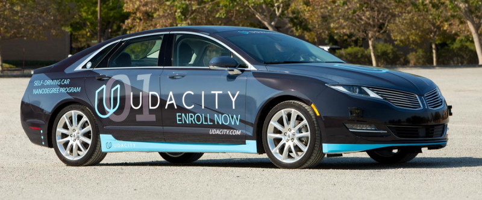
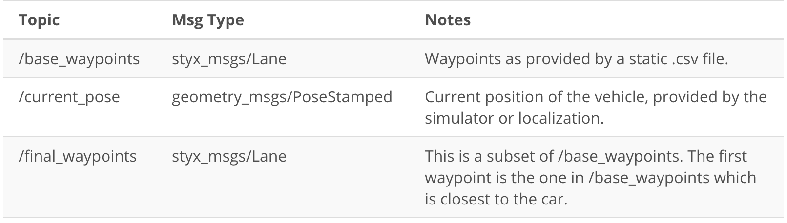

## Capstone Project - System Integration

### Team Members:
 - Wenkai Ren (Team Lead) wr2291@columbia.edu
 - Zeyuan Jin  zj2212@columbia.edu
---

For this project, we will use ROS nodes to implement core functionality of the autonomous vehicle system, including traffic light detection, control, and waypoint following. The nodes will be tested on Udacity simulator, after passing the test, our group can submit the project to be run on [CARLA](https://medium.com/udacity/how-the-udacity-self-driving-car-works-575365270a40).

The following is a system architecture diagram showing the ROS nodes and topics used in the project. You can refer to the diagram throughout the project as needed. The ROS nodes and topics shown in the diagram are described briefly in the Code Structure section below, and more detail is provided for each node in later classroom concepts of this lesson.



## System Architecture Diagram

- Perception: based camera image to percept the traffic lights.

- Planning: based on the next waypoit to and decision of the traffic light waypoint to genearate future path waypoints.

- Control: based on the planning data of the trajectory, by sending the control commands through steering, throttle and brake values.


## Ros Nodes:

### Waypoint Upadater Node:

- capstone/ros/src/waypoint_updater/

The purpose of this node is to update the target velocity property of each waypoint based on traffic light and obstacle detection data. This node will subscribe to the **/base_waypoints**, **/current_pose**, **/obstacle_waypoint**, and **/traffic_waypoint** topics, and publish a list of waypoins ahead of the car with target velocities to the **/final_waypoints** topic.




### DBW Node: 

- /ros/src/twist_controller/

Carla is equipped with a drive-by-wire (dbw) system, meaning the throttle, brake, and steering have electronic control. This package contains the files that are responsible for control of the vehicle: the node **dbw_node.py** and the file **twist_controller.py**, along with a pid and lowpass filter that you can use in your implementation. The dbw_node subscribes to the **/current_velocity** topic along with the **/twist_cmd** topic to receive target linear and angular velocities. Additionally, this node will subscribe to **/vehicle/dbw_enabled**, which indicates if the car is under dbw or driver control. This node will publish throttle, brake, and steering commands to the **/vehicle/throttle_cmd**, **/vehicle/brake_cmd**, and **/vehicle/steering_cmd** topics.

** dbw_node.py ** :

It subscribers for the /current_velocity, /twist_cmd, and /vehicle/dbw_enabled topics. This file also imports the Controller class from twist_controller.py which will be used for implementing the necessary controllers. The function used to publish throttle, brake, and steering is publish.


**twist_controller.py**

The controller we used for the **twist_controller.py** are PID controller for velocity ,Yaw controller for steering angle and Lowpass controller for filtering velocity.

Yaw controller :

    self.yaw_controller = YawController(wheel_base, steer_ratio, 0.1, max_lat_accel, max_steer_angle)

PID controller : 

    kp = 0.3
    ki = 0.1
    kd = 0.
    mn = 0. #Minimum throttle value
    mx = 0.2 # Maximum throttle value
    self.throttle_controller = PID(kp, ki, kd, mn, mx)


### Trafic light Detection:

- /ros/src/tl_detector/

This package contains the traffic light detection node: ** tl_detector.py**. This node takes in data from the **/image_color**, **/current_pose** , and **/base_waypoints** topics and publishes the locations to stop for red traffic lights to the **/traffic_waypoint** topic.

The **/current_pose** topic provides the vehicle's current position, and **/base_waypoints** provides a complete list of waypoints the car will be following. Traffic light detection should take place within tl_detector.py, whereas traffic light classification should take place within ../tl_detector/light_classification_model/tl_classfier.py.


**traffic light detection node ** :

Identifies red lights in the incoming camera image and publishes the inxdex of the waypoint closest to the red light's stop line to  **/traffic_waypoint** . The core decision making is shown below to make sure the car drives safely at the intersection with the traffic light.

Publish upcoming red lights at camera frequency.
Each predicted state has to occur `STATE_COUNT_THRESHOLD` number
of times till we start using it. Otherwise the previous stable state is
used.

        if self.state != state:
           self.state_count = 0
           self.state = state
        elif self.state_count >= STATE_COUNT_THRESHOLD:
            self.last_state = self.state
            light_wp = light_wp if state == TrafficLight.RED else -1
            self.last_wp = light_wp
            self.upcoming_red_light_pub.publish(Int32(light_wp))
        else:
            self.upcoming_red_light_pub.publish(Int32(self.last_wp))
        self.state_count += 1

**traffic light classification node **:

There are two methods used in the Traffic Light classification, the first method is based on the traditional computer vision method, by converting the receiving image into HSV channel to create the red mask :

        image = cv2.cvtColor(image, cv2.COLOR_BGR2RGB)
        image_blur = cv2.GaussianBlur(image, (7,7), 0)
        image_blur_hsv = cv2.cvtColor(image_blur, cv2.COLOR_RGB2HSV)
        mask1 = cv2.inRange(image_blur_hsv, self.min_red1, self.max_red1)
        mask2 = cv2.inRange(image_blur_hsv, self.min_red2, self.max_red2)
        mask = mask1 + mask2
        
use the masked image to find to contour to identify if there is a red circle detected: 

        kernel = cv2.getStructuringElement(cv2.MORPH_ELLIPSE, (8, 8))
        mask_closed = cv2.morphologyEx(mask, cv2.MORPH_CLOSE, kernel)
        mask_clean = cv2.morphologyEx(mask_closed, cv2.MORPH_OPEN, kernel)
        _, contours, _ = cv2.findContours(mask_clean, cv2.RETR_LIST, cv2.CHAIN_APPROX_SIMPLE)

        if len(contours) > 0:
            return TrafficLight.RED
        else:
            return TrafficLight.UNKNOWN

### Visualization Results

- Visualize of the detected red image :


- Visualize of the detection green image:


-----------------------------------------------------
## ** The Final testing video in Youtube Link : **

https://www.youtube.com/watch?v=sJEOZjnQmDQ

-----------------------------------------------------

This is the project repo for the final project of the Udacity Self-Driving Car Nanodegree: Programming a Real Self-Driving Car. For more information about the project, see the project introduction [here](https://classroom.udacity.com/nanodegrees/nd013/parts/6047fe34-d93c-4f50-8336-b70ef10cb4b2/modules/e1a23b06-329a-4684-a717-ad476f0d8dff/lessons/462c933d-9f24-42d3-8bdc-a08a5fc866e4/concepts/5ab4b122-83e6-436d-850f-9f4d26627fd9).

Please use **one** of the two installation options, either native **or** docker installation.

### Native Installation

* Be sure that your workstation is running Ubuntu 16.04 Xenial Xerus or Ubuntu 14.04 Trusty Tahir. [Ubuntu downloads can be found here](https://www.ubuntu.com/download/desktop).
* If using a Virtual Machine to install Ubuntu, use the following configuration as minimum:
  * 2 CPU
  * 2 GB system memory
  * 25 GB of free hard drive space

  The Udacity provided virtual machine has ROS and Dataspeed DBW already installed, so you can skip the next two steps if you are using this.

* Follow these instructions to install ROS
  * [ROS Kinetic](http://wiki.ros.org/kinetic/Installation/Ubuntu) if you have Ubuntu 16.04.
  * [ROS Indigo](http://wiki.ros.org/indigo/Installation/Ubuntu) if you have Ubuntu 14.04.
* [Dataspeed DBW](https://bitbucket.org/DataspeedInc/dbw_mkz_ros)
  * Use this option to install the SDK on a workstation that already has ROS installed: [One Line SDK Install (binary)](https://bitbucket.org/DataspeedInc/dbw_mkz_ros/src/81e63fcc335d7b64139d7482017d6a97b405e250/ROS_SETUP.md?fileviewer=file-view-default)
* Download the [Udacity Simulator](https://github.com/udacity/CarND-Capstone/releases).

### Docker Installation
[Install Docker](https://docs.docker.com/engine/installation/)

Build the docker container
```bash
docker build . -t capstone
```

Run the docker file
```bash
docker run -p 4567:4567 -v $PWD:/capstone -v /tmp/log:/root/.ros/ --rm -it capstone
```

### Port Forwarding
To set up port forwarding, please refer to the [instructions from term 2](https://classroom.udacity.com/nanodegrees/nd013/parts/40f38239-66b6-46ec-ae68-03afd8a601c8/modules/0949fca6-b379-42af-a919-ee50aa304e6a/lessons/f758c44c-5e40-4e01-93b5-1a82aa4e044f/concepts/16cf4a78-4fc7-49e1-8621-3450ca938b77)

### Usage

1. Clone the project repository
```bash
git clone https://github.com/udacity/CarND-Capstone.git
```

2. Install python dependencies
```bash
cd CarND-Capstone
pip install -r requirements.txt
```
3. Make and run styx
```bash
cd ros
catkin_make
source devel/setup.sh
roslaunch launch/styx.launch
```
4. Run the simulator

### Real world testing
1. Download [training bag](https://s3-us-west-1.amazonaws.com/udacity-selfdrivingcar/traffic_light_bag_file.zip) that was recorded on the Udacity self-driving car.
2. Unzip the file
```bash
unzip traffic_light_bag_file.zip
```
3. Play the bag file
```bash
rosbag play -l traffic_light_bag_file/traffic_light_training.bag
```
4. Launch your project in site mode
```bash
cd CarND-Capstone/ros
roslaunch launch/site.launch
```
5. Confirm that traffic light detection works on real life images
